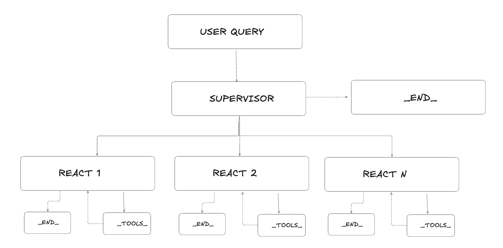

# FinBot 

FinBot is an LLM-powered chatbot that provides financial information around companies or macroeconomic indicators. It uses a set of tools to fetch relevant data and provide responses to users query. Tools rely mostly on free API, libraries such as yfinance for stock price data and listed company financial metrics, FRED API for macroeconomic data, Edgard downloader for 10ks (publicly listed companies annual report data) and Tavily (non free) API for news.  

## UI Preview

[](https://www.youtube.com/watch?v=fJ11fHgllRM)

## Agent architecture

The below diagram summarizes the agentic pattern followed by this app: a supervisor delegating tasks to independent nodes, each a ReAct agent with its own set of tools.



## Which LLM can I use?

Given the heavy reliance on tool calling functionalities, the selected LLM should have reasonably high score at it. Leaderboard for tool calling can be found here: 

[https://gorilla.cs.berkeley.edu/leaderboard.html]

LLMs are currently called via the Langchain ChatBase Model interface, hence you if you wish to adapt to whatever LLM you like you can change the following lines of codes throughout in the code:

Change this
```
finbot_graph = create_graph(
      LLMService(
         llm_provider="openai",
         model_name="gpt-4o-mini",
         api_key=os.getenv("OPENAI_API_KEY"),
      ).client
)
```
to:

```
finbot_graph = create_graph(
      LLMService(
         llm_provider="ANTHROPIC/GROQ",
         model_name="claude/llama",
         api_key=os.getenv("CHOSEN_LLM_API_KEY"),
      ).client
)
```
The LLM service class accepts OPENAI / ANTHROPIC / GROQ as model providers but is of course extendible depending on what model LangChain Chat Base model support.

## Setup

### Prerequisites

- Python 3.13 or higher
- [Poetry](https://python-poetry.org/docs/#installation) dependency manager
- OpenAI API key 

### Installation

1. Clone the repository:
   ```
   git clone <repository-url>
   cd finbot
   ```

2. Create environment files:
   ```
   cp .env.example .env
   ```

3. Edit the `.env` file to add your API keys:
   ```
   # For OpenAI
   OPENAI_API_KEY=your_openai_api_key
   
   # For Tavily News
   TAVILY_API_KEY=your_tavily_api_key
   
   # For Fred Macro Economics data
   FRED_API_KEY=your_fred_api_key
   ```

4. Install dependencies using Poetry:
   ```
   poetry install
   ```

## Running the Application

You can run the application components using Poetry's run commands:

### Running the Backend

```bash
poetry run start-backend
```

The API will be available at `http://localhost:8000`.

### Running the Frontend

```bash
poetry run start-frontend
```
The Dash app will be available at `http://localhost:8502`.


### Running the MCP server

```bash
poetry run start-mcp
```
The MCP API will be available at `http://localhost:5005`.

## Development with Poetry

To enter the Poetry virtual environment for development:

```
poetry shell
```

To add new dependencies:

```
poetry add package-name
```

To add development-only dependencies:

```
poetry add --group dev package-name
```

## Usage

1. Open the app in your browser at `http://localhost:8502`.
2. You'll see an interface with example questions displayed.
3. Click on any example question or type your own financial/macro query.
4. The chat interface will appear with the AI-generated response and any relevant charts.
5. Continue your conversation with follow-up questions.

## LangGraph Integration

FinBot uses LangGraph, a framework for building stateful, multi-agent workflows:

- **Agentic Workflow**: The backend uses a supervisor-worker pattern with specialized agents for different tasks.
- **Stock Data Tool**: Integrated tool for fetching historical stock prices from Yahoo Finance.
- **Chart Generation**: Automatic generation of stock price charts based on query context.
- **Financial Statements**: Fetch and analyze balance sheets, income statements, and cash flow statements.
- **Stateful Processing**: Maintains state between nodes, allowing complex multi-step reasoning.
- **Annual Reports Analysis**: RAG-powered processing of SEC 10-K filings.

The workflow consists of:
1. A supervisor node that routes the user query to the appropriate worker while returning a default answer if user query cannot bet met by existing nodes and their tools
2. Specialized worker nodes for different tasks:
   - Stock price data retrieval
   - Chart generation
   - Financial metrics analysis  
   - Annual report analysis with RAG
   - News search
   - Macroeconomic data analysis


## MCP Compatibility

FinBot has a basic implementation of the Model Context Protocol (MCP) (custom made, official Python SDK for MCP has at the moment dependency issues with langhcain adapters), allowing for more flexible deployment and integration:

- **MCP-Compatible Tools**: Financial tools have been adapted to work with the MCP protocol.
- **MCP Server**: Dedicated server implementation for MCP-based communication.
- **Cross-Platform Integration**: Enables FinBot tools to be used across different LLM providers and applications that support MCP.


## Example Questions

- How has Apple performed over the last year?
- What are Tesla's key financial metrics?
- Compare the revenue growth of Microsoft and Google.
- What is the P/E ratio of Amazon compared to industry average?
- Show me the dividend yield for Coca-Cola
- What risks does Apple mention in their latest annual report?


## Limitations

- Data may not be real-time and should not be used for investment decisions
- Limited to financial information that is publicly available
- RAG processing of annual reports may not capture all nuances or details 