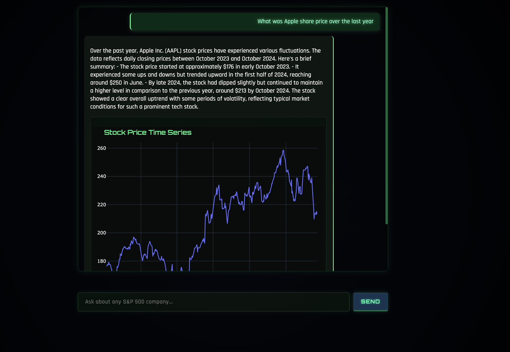
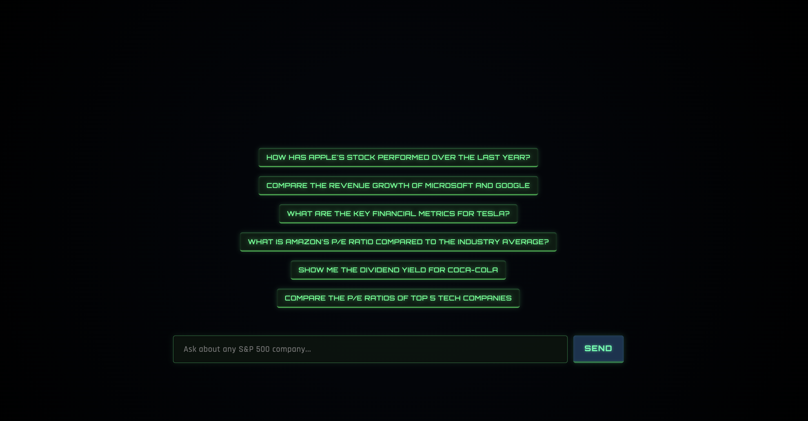

# FinBot - Financial Information Chatbot

FinBot is an AI-powered chatbot that provides information about publicly listed companies, primarily from the S&P 500 index. Users can ask questions in natural language and receive AI-generated responses with relevant charts and financial insights.

## UI Preview




## Project Structure

```
finbot/
├── app/
│   ├── __init__.py
│   ├── main.py          # FastAPI backend application
│   ├── finbot/          # LangGraph agentic workflow
│   │   ├── agents.py    # Agent definitions
│   │   ├── graphs.py    # LangGraph structure
│   │   ├── nodes.py     # Graph nodes 
│   │   ├── services.py  # Singleton services (LLM, RAG engines)
│   │   ├── tools.py     # Financial tools
│   │   ├── mcp_agents.py # MCP-compatible agents
│   │   └── mcp_finbot/   # MCP integration
│   │       ├── mcp_tools.py        # MCP-compatible tools
│   │       └── mcp_servers_finbot.py # MCP server configuration
│   └── llm/             # LLM-related utilities
│       ├── llm_service.py  # LLM provider management
│       ├── rag_query_engine.py # RAG implementation for annual reports
│       └── groq.py      # Groq API integration
├── ui/
│   ├── __init__.py
│   ├── ui_dash.py       # Dash application with cyberpunk UI
├── logs/                # Application logs directory
├── pyproject.toml       # Poetry configuration and dependencies
├── .env.example         # Example environment variables
└── README.md            # This file
```

## Setup

### Prerequisites

- Python 3.13 or higher
- [Poetry](https://python-poetry.org/docs/#installation) dependency manager
- OpenAI API key (or Groq API key)

### Installation

1. Clone the repository:
   ```
   git clone <repository-url>
   cd finbot
   ```

2. Create environment files:
   ```
   cp .env.example .env
   ```

3. Edit the `.env` file to add your API keys:
   ```
   # For OpenAI
   OPENAI_API_KEY=your_openai_api_key
   
   # For Groq (optional)
   GROQ_API_KEY=your_groq_api_key
   ```

4. Install dependencies using Poetry:
   ```
   poetry install
   ```

## Running the Application

You can run the application components using Poetry's run commands:

### Running the Backend

```bash
poetry run start-backend
```

The API will be available at `http://localhost:8000`.

### Running the Frontend

```bash
poetry run start-frontend
```

The Dash app will be available at `http://localhost:8502`.

## Development with Poetry

To enter the Poetry virtual environment for development:

```
poetry shell
```

To add new dependencies:

```
poetry add package-name
```

To add development-only dependencies:

```
poetry add --group dev package-name
```

## Usage

1. Open the app in your browser at `http://localhost:8502`.
2. You'll see an interface with example questions displayed.
3. Click on any example question or type your own query about a publicly listed company.
4. The chat interface will appear with the AI-generated response and any relevant charts.
5. Continue your conversation with follow-up questions.

## LangGraph Integration

FinBot uses LangGraph, a framework for building stateful, multi-agent workflows:

- **Agentic Workflow**: The backend uses a supervisor-worker pattern with specialized agents for different tasks.
- **Stock Data Tool**: Integrated tool for fetching historical stock prices from Yahoo Finance.
- **Chart Generation**: Automatic generation of stock price charts based on query context.
- **Financial Statements**: Fetch and analyze balance sheets, income statements, and cash flow statements.
- **Stateful Processing**: Maintains state between nodes, allowing complex multi-step reasoning.
- **Annual Reports Analysis**: RAG-powered processing of SEC 10-K filings.

The workflow consists of:
1. A supervisor node that routes the user query to the appropriate worker
2. Specialized worker nodes for different tasks:
   - Stock price data retrieval
   - Chart generation
   - Financial metrics analysis  
   - Annual report analysis with RAG
   - News search
   - Macroeconomic data analysis

## Recent Updates

### MCP Compatibility

FinBot now supports the Model Context Protocol (MCP) (with a similar implementation to the official MCP Python SDK), allowing for more flexible deployment and integration:

- **MCP-Compatible Tools**: Financial tools have been adapted to work with the MCP protocol.
- **MCP Server**: Dedicated server implementation for MCP-based communication.
- **Cross-Platform Integration**: Enables FinBot tools to be used across different LLM providers and applications that support MCP.

### RAG for Annual Reports

Added Retrieval-Augmented Generation (RAG) capabilities for analyzing company annual reports:

- **SEC 10-K Integration**: Automatically fetches the latest annual reports from the SEC.
- **RAG Engine Service**: Centralized service that manages indexed reports.
- **Vector-Based Retrieval**: Efficient searching through lengthy reports.
- **Contextual Answers**: Provides specific answers to questions about company financials, risks, and strategies.

### Enhanced Data Visualization

- **Multiple Chart Types**: Support for line charts, bar charts, and more.
- **Financial Chart Formatting**: Specialized formatting for financial metrics.
- **Markdown Rendering**: Improved text formatting in the chat interface.

## Example Questions

- How has Apple performed over the last year?
- What are Tesla's key financial metrics?
- Compare the revenue growth of Microsoft and Google.
- What is the P/E ratio of Amazon compared to industry average?
- Show me the dividend yield for Coca-Cola
- What risks does Apple mention in their latest annual report?
- What macroeconomic factors affected tech stocks in the last year?

## Features

- Natural language processing for financial queries
- Integration with financial data sources via LangGraph
- Dynamic chart generation for data visualization
- RAG-powered analysis of annual reports
- Conversational UI with persistent chat history

## Limitations

- Data may not be real-time and should not be used for investment decisions
- Limited to financial information that is publicly available
- RAG processing of annual reports may not capture all nuances or details 